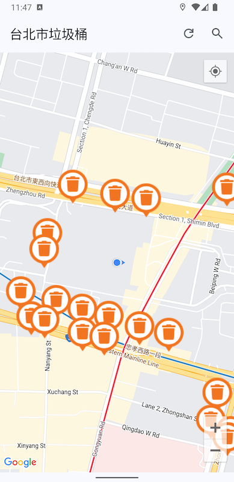
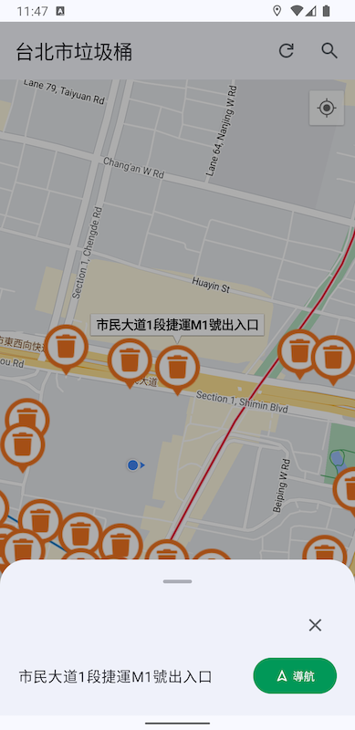
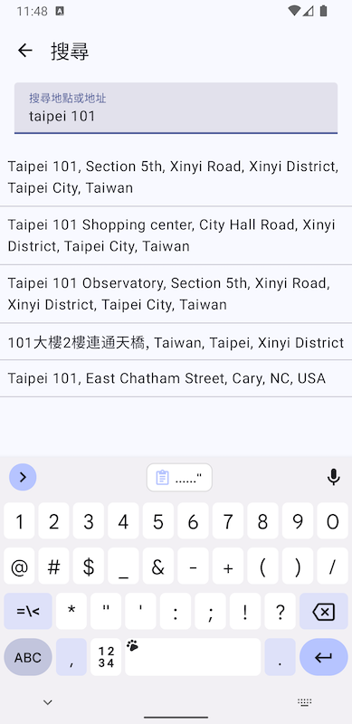

# 台北市行人垃圾桶地圖

使用 Jetpack Compose 重寫的版本。

## 建構

1. 在專案根目錄下新增一個 `secrets.properties` 檔案。
2. 在 `secrets.properties` 裡填入你的 Google Map API Key 跟 Places API Key：

    ```
    MAPS_API_KEY="AIza......"
    PLACES_API_KEY="AIza......"
    ```

## 截圖








## License

MIT License
